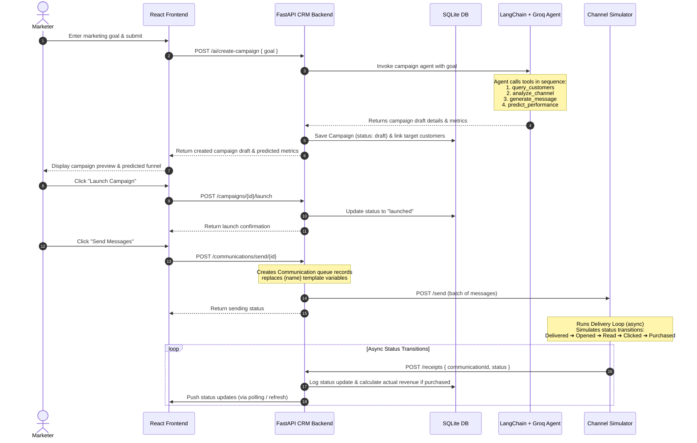

# ⚡ Xeno Mini CRM

An AI-powered Customer Relationship Management (CRM) & Marketing Campaign Automation platform. **Xeno Mini CRM** allows businesses to ingest customer data, define marketing goals in natural language, automatically generate targeted campaigns via intelligent AI agents, simulate multi-stage message delivery funnels, and analyze campaign conversion metrics in real-time.

---

## 🏗️ System Architecture & Data Flow

Xeno Mini CRM consists of three main components:

1. **Frontend**: React (v19) application built with Vite and Tailwind CSS. It leverages Recharts for conversion funnels and Lucide icons for UI elements.
2. **CRM Backend**: FastAPI web application using SQLModel (SQLite database) and LangChain combined with Groq (Llama 3.1 8B) to run autonomous campaign creation agents.
3. **Channel Simulator**: A lightweight FastAPI microservice that simulates real-world messaging channels (WhatsApp, SMS, Email). It processes sent campaigns and triggers asynchronous postbacks (webhooks) to simulate status transitions (`queued` → `delivered` → `opened` → `read` → `clicked` → `purchased` or `failed`).

### 🔄 Data & Communication Flow



---

## 🗄️ Database Architecture & Schema Reference

The CRM backend utilizes SQLModel to manage database tables. When using SQLite, the tables are persisted inside the local `dev.db` file. The primary schemas are defined as follows:

### 1. `Customer` Table
Stores main profiles of customers.
*   `id` (*Optional[int]*, Primary Key): Unique identifier.
*   `name` (*str*): Full name of the customer.
*   `email` (*str*): Email address.
*   `phone` (*str*): Phone number with country code.
*   `city` (*str*): City of residence.
*   `age` (*int*): Customer age.
*   `total_spending` (*float*, Default: `0.0`): Accumulated amount spent across all completed orders.
*   `last_purchase_date` (*Optional[datetime]*, Default: `None`): Timestamp of the last completed order.
*   `created_at` (*datetime*, Default: `utcnow`): Record creation time.

### 2. `Order` Table
Tracks individual purchases made by customers.
*   `id` (*Optional[int]*, Primary Key): Unique identifier.
*   `customer_id` (*int*, Foreign Key: `customer.id`): Associated customer.
*   `amount` (*float*): Total order price.
*   `status` (*str*, Default: `"completed"`): Order state (e.g. `completed`, `returned`).
*   `ordered_at` (*datetime*, Default: `utcnow`): Timestamp of the order transaction.

### 3. `Campaign` Table
Defines marketing initiatives.
*   `id` (*Optional[int]*, Primary Key): Unique identifier.
*   `name` (*str*): Marketing campaign name.
*   `goal` (*str*): Original natural language instruction/goal.
*   `channel` (*str*, Default: `"whatsapp"`): Target messaging medium (`whatsapp`, `sms`, `email`).
*   `message_template` (*str*): Message copywriting template containing `{name}` placeholder variable.
*   `filters` (*str*, Default: `"{}"`): JSON string of demographic filters used to compile the target segment.
*   `status` (*str*, Default: `"draft"`): Lifecycle state (`draft`, `launched`).
*   `audience_count` (*int*, Default: `0`): Calculated size of the filtered audience list.
*   `predicted_revenue` (*float*, Default: `0.0`): Estimated revenue calculated by the AI agent.
*   `actual_revenue` (*float*, Default: `0.0`): Aggregated conversion revenue tracked from successful conversion postbacks.
*   `created_at` (*datetime*, Default: `utcnow`): Record creation time.
*   `launched_at` (*Optional[datetime]*): Timestamp indicating when the campaign was launched.

### 4. `CampaignCustomer` Table (Many-to-Many Join Table)
Links campaigns to their target customer list.
*   `id` (*Optional[int]*, Primary Key): Unique identifier.
*   `campaign_id` (*int*, Foreign Key: `campaign.id`): Associated campaign.
*   `customer_id` (*int*, Foreign Key: `customer.id`): Associated customer.

### 5. `Communication` Table
Stores logs of individual messages generated and sent out to the simulator.
*   `id` (*Optional[int]*, Primary Key): Unique identifier.
*   `campaign_id` (*int*, Foreign Key: `campaign.id`): Associated campaign.
*   `customer_id` (*int*, Foreign Key: `customer.id`): Recipient customer.
*   `channel` (*str*): Delivery method (`whatsapp`, `sms`, `email`).
*   `message` (*str*): Personalized text dispatched (placeholder replaced with customer's first name).
*   `phone` (*str*): Recipient phone number.
*   `status` (*str*, Default: `"queued"`): Current status of transmission (`queued`, `delivered`, `failed`, `opened`, `read`, `clicked`, `purchased`).
*   `sent_at` (*datetime*, Default: `utcnow`): Initial dispatch time.
*   `updated_at` (*datetime*, Default: `utcnow`): Timestamp of the last status change.

### 6. `CommunicationEvent` Table
Stores chronological status updates for communications, useful for historical analysis.
*   `id` (*Optional[int]*, Primary Key): Unique identifier.
*   `communication_id` (*int*, Foreign Key: `communication.id`): Associated communication.
*   `status` (*str*): Status state recorded.
*   `received_at` (*datetime*, Default: `utcnow`): Event receipt timestamp.

---

## 🤖 AI Campaign Agent Mechanics & Prompts

The autonomous generation flow is coordinated by a LangChain agent using the `llama-3.1-8b-instant` model on Groq. The agent is initialized with a custom system prompt:

```
You are an AI campaign creation agent for a CRM system.
When given a marketing goal, you MUST call all 4 tools in order:
1. tool_query_customers — find the right audience
2. tool_analyze_channel — pick the best channel
3. tool_generate_message — write the message template
4. tool_predict_performance — estimate funnel metrics

After all 4 tools, return a JSON object with EXACTLY these keys:
{
  "name": "campaign name based on goal",
  "goal": "the original goal",
  "filters": {filters used},
  "audience_count": <number>,
  "channel": "whatsapp|sms|email",
  "message_template": "the message",
  "predicted_revenue": <number>,
  "predicted_metrics": {...funnel numbers}
}
Return ONLY valid JSON, no markdown, no explanation.
```

### Agent Tools
1.  **`tool_query_customers(filters_json)`**: Runs a filter search on SQLite. Supported filter fields: `city`, `min_age`, `max_age`, `min_spending`, `inactive_days`.
2.  **`tool_analyze_channel(goal)`**: Evaluates performance patterns matching the goal and suggests WhatsApp, SMS, or Email.
3.  **`tool_generate_message(goal, channel)`**: Creates tailored message copywriting.
4.  **`tool_predict_performance(audience_count, channel)`**: Models conversion expectations.

### Additional AI Services
*   **Insight Engine (`generate_insights`)**: Queries campaign metrics and formats exactly 4 concise performance insights.
*   **Retargeting Advisor (`generate_retargeting_advice`)**: Evaluates click-to-purchase dropdowns and writes 3 strategic retargeting checklist tasks.
*   **Personalization (`personalize_message`)**: Dynamically overrides generic parameters with detailed customer properties.

---

## 🔌 API Reference Specification

### 👥 Customers Routes
*   **`GET /customers/`**: Get filtered list of customers.
    *   *Query Parameters*: `city` (str), `min_age` (int), `max_age` (int), `min_spending` (float), `inactive_days` (int), `limit` (int, default=50), `offset` (int, default=0).
*   **`GET /customers/count`**: Get count of customers matching the filters.
*   **`GET /customers/{customer_id}`**: Retrieve detailed customer profile.
*   **`POST /customers/upload`**: Ingest customer data via CSV file uploads.
    *   *Payload*: Multipart form-data with key `file`.

### 📢 Campaigns Routes
*   **`GET /campaigns/`**: List all saved campaigns.
*   **`GET /campaigns/{campaign_id}`**: Get campaign details by ID.
*   **`POST /campaigns/`**: Manually save a new campaign draft.
    *   *Request Body*: `CampaignCreate` (JSON).
*   **`POST /campaigns/{campaign_id}/launch`**: Transition status from `draft` to `launched`.
*   **`DELETE /campaigns/{campaign_id}`**: Remove a campaign record.

### ✉️ Communications Routes
*   **`POST /communications/send/{campaign_id}`**: Retrieve target audience from `CampaignCustomer`, build personalized messages, create `Communication` queue records, and dispatch payloads to the simulator.

### 📥 Simulator Receipt Webhook
*   **`POST /receipts/`**: Update status of an individual communication. Evaluates callback ordering using sequential values.
    *   *Request Body*: `{"communicationId": int, "status": str}`.
    *   If status transitions to `purchased`, actual campaign revenue is increased based on `customer.total_spending * 0.1`.

### 📊 Analytics Routes
*   **`GET /analytics/`**: Returns global statistics (total campaigns, total messages sent, status counts, conversion rates, and total aggregate actual revenue).
*   **`GET /analytics/{campaign_id}`**: Returns specific campaign metrics (sent, delivered, opened, read, clicked, purchased totals, conversion rates, and comparison between predicted vs. actual revenue).

### 🤖 AI Routes
*   **`POST /ai/create-campaign`**: Initiate the LangChain tool agent loop using a marketing goal.
    *   *Request Body*: `{"goal": str}`.
*   **`GET /ai/insights/{campaign_id}`**: Uses Groq to generate 4 campaign analysis insights and 3 retargeting tips.
*   **`POST /ai/personalize`**: Generates a customized message draft.
    *   *Request Body*: `{"template": str, "customer": dict}`.

---

## ⚙️ Environment Variables Reference

| Variable Name | Component | Required For | Default Value | Description |
| :--- | :--- | :--- | :--- | :--- |
| `DATABASE_URL` | `crm-backend` | SQLite Connection | `sqlite:///./dev.db` | File path endpoint to store DB tables. |
| `GROQ_API_KEY` | `crm-backend` | LLM API Requests | *(None)* | API authorization key for Groq inference. |
| `CHANNEL_SIMULATOR_URL` | `crm-backend` | HTTP Dispatches | `http://localhost:8001` | Destination host where simulator listens. |
| `CRM_RECEIPT_URL` | `channel-simulator` | Status Webhooks | `http://localhost:8000/receipts/` | Target endpoint for posting status updates. |
| `VITE_API_URL` | `frontend` | Axios API Client | `http://localhost:8000` | Target URL where CRM backend runs. |

---

## 🛠️ Step-by-Step Installation & Setup

### Prerequisites
*   **Python 3.10+**
*   **Node.js 18+** (with NPM)
*   A **Groq API Key** (obtained from [Groq Console](https://console.groq.com/))

---

### Step 1: Run the FastAPI CRM Backend

1. Navigate to the backend directory:
   ```bash
   cd crm-backend
   ```
2. Create and activate a Python virtual environment:
   *   **Windows**:
       ```powershell
       python -m venv venv
       venv\Scripts\activate
       ```
   *   **macOS / Linux**:
       ```bash
       python -m venv venv
       source venv/bin/activate
       ```
3. Install Python dependencies:
   ```bash
   pip install -r requirements.txt
   ```
4. Configure your environment variables:
   Create a `.env` file inside `crm-backend/` containing:
   ```env
   DATABASE_URL=sqlite:///./dev.db
   GROQ_API_KEY=gsk_yourKeyHere
   CHANNEL_SIMULATOR_URL=http://localhost:8001
   ```
5. Launch the FastAPI server:
   ```bash
   uvicorn main:app --reload --port 8000
   ```
   *Note: On startup, the backend automatically sets up the SQLite schema in `dev.db` and seeds 500 mock customer records and 2,000 orders if the database is blank.*

---

### Step 2: Run the Channel Simulator

1. Open a new terminal window and navigate to the simulator directory:
   ```bash
   cd channel-simulator
   ```
2. Create and activate a Python virtual environment:
   *   **Windows**:
       ```powershell
       python -m venv venv
       venv\Scripts\activate
       ```
   *   **macOS / Linux**:
       ```bash
       python -m venv venv
       source venv/bin/activate
       ```
3. Install Python dependencies:
   ```bash
   pip install -r requirements.txt
   ```
4. Configure your environment variables:
   Create a `.env` file inside `channel-simulator/` containing:
   ```env
   CRM_RECEIPT_URL=http://localhost:8000/receipts/
   ```
5. Start the simulator server:
   ```bash
   uvicorn main:app --reload --port 8001
   ```

---

### Step 3: Run the React Frontend

1. Open a third terminal window and navigate to the frontend directory:
   ```bash
   cd frontend
   ```
2. Install npm node modules:
   ```bash
   npm install
   ```
3. Configure your environment variables:
   Create a `.env` file inside `frontend/` containing:
   ```env
   VITE_API_URL=http://localhost:8000
   ```
4. Run the Vite development server:
   ```bash
   npm run dev
   ```
5. Open your web browser and navigate to the local address displayed (usually [http://localhost:5173](http://localhost:5173)).

---

## 📈 Channel Simulator Status Pipeline

When the CRM backend dispatches communications, they are queued up in the simulator. The simulator propagates them asynchronously through a sequence of states, waiting a randomized delay between stages:

```
[queued] ──(2-5s)──► [delivered] ──(5-15s)──► [opened] ──(3-8s)──► [read] ──(10-30s)──► [clicked] ──(15-45s)──► [purchased]
   │                      │                    │                  │                   │
   ├─► (15% Fail)         ├─► (20% Fail)       ├─► (10% Fail)     ├─► (75% Fail)      └─► (70% Fail)
   ▼                      ▼                    ▼                  ▼                   ▼
[failed]               [failed]             [failed]           [failed]            [failed]
```

At any stage, if a transition fails (based on the transition probabilities), the simulator posts `status: failed` back to the CRM and stops. If it succeeds, it updates the backend with the new status event and queues the next transition step.

---

## 📥 Customer Data Ingestion Schema

Marketers can import custom subscriber lists using the CSV upload feature. The CSV file must include the following headers:

```csv
name,email,phone,city,age,total_spending
Rahul Sharma,rahul@gmail.com,+919876543210,Mumbai,28,15000
Priya Singh,priya@yahoo.com,+919876543211,Delhi,32,8500
```

*   `name`: Customer full name (string)
*   `email`: Email address (string)
*   `phone`: Mobile contact number (string)
*   `city`: City name (string)
*   `age`: Age (integer)
*   `total_spending`: Previous checkout value (float)

---

## 🚀 Production Deployment Guidelines

### 1. Backend & Simulator Deployment (e.g., Render or Heroku)
*   Deploy each folder (`crm-backend` and `channel-simulator`) as a separate Web Service.
*   For `crm-backend`, set the start command to: `uvicorn main:app --host 0.0.0.0 --port $PORT`.
*   Ensure that you set all required Environment Variables in the provider's Dashboard (e.g. `GROQ_API_KEY`, `CHANNEL_SIMULATOR_URL`, and `CRM_RECEIPT_URL` referencing the newly deployed live domains).
*   For persistent databases in production, configure a PostgreSQL database URL and supply it to `DATABASE_URL` instead of SQLite.

### 2. Frontend Deployment (e.g., Vercel, Netlify, or Amplify)
*   Link the `frontend` folder.
*   Configure the build command to: `npm run build` and output directory to `dist`.
*   Set Environment Variable `VITE_API_URL` to point to your live CRM Backend URL.

---

## ❓ Troubleshooting FAQs

#### Q: I run uvicorn on `crm-backend` and it throws a database lock error.
A: This usually happens on Windows if SQLite (`dev.db`) is open in an external database viewer (like DB Browser for SQLite) or if multiple backend processes are running. Make sure you close external connection locks and kill overlapping python processes.

#### Q: The AI Campaign Wizard throws a 500 error when clicking "Generate".
A: Double-check that your `GROQ_API_KEY` is set correctly inside `crm-backend/.env`. If the key is correct, verify that you haven't hit Groq's API rate limits or quota caps.

#### Q: Communications are stuck on "queued" status and never update.
A: Ensure that the `channel-simulator` is running on port `8001` and that `crm-backend/.env` has `CHANNEL_SIMULATOR_URL` configured to point to it. Additionally, verify that `channel-simulator/.env` points to the correct backend host (default: `http://localhost:8000/receipts/`).
